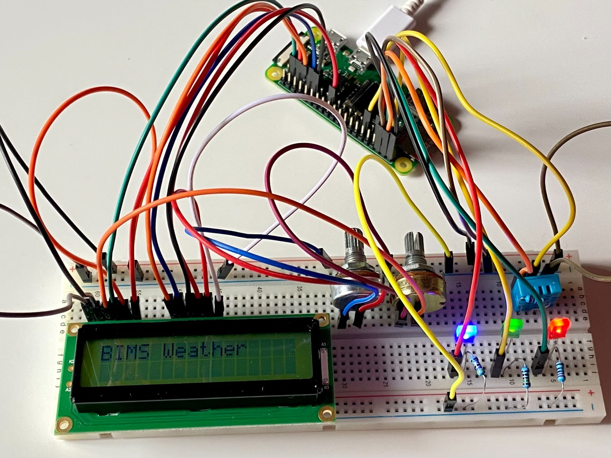
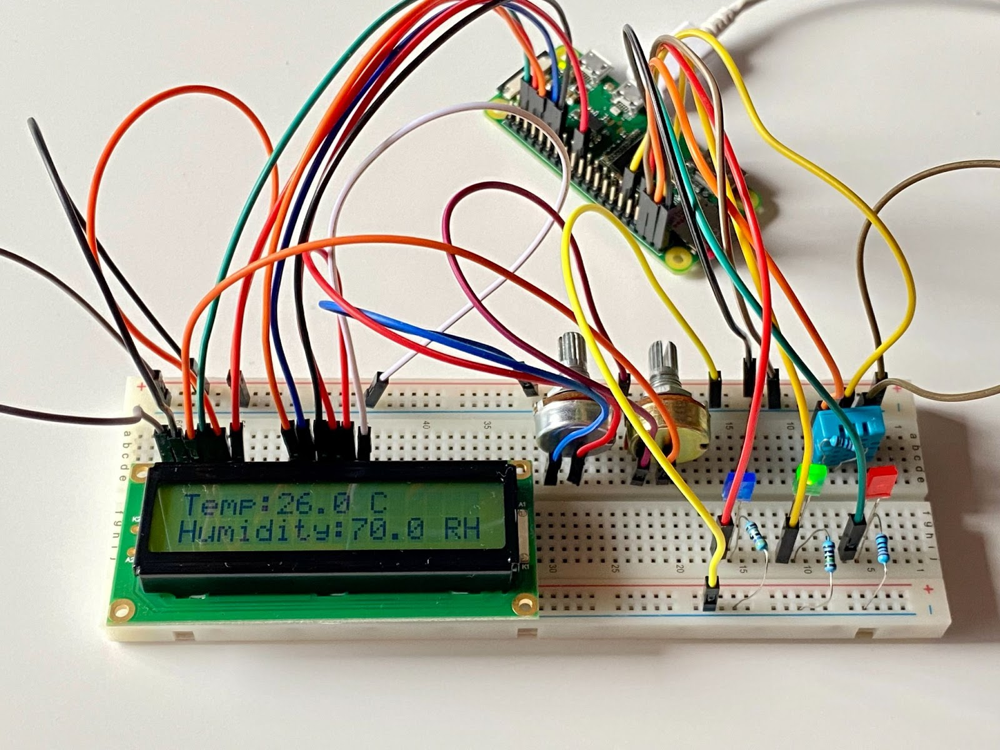
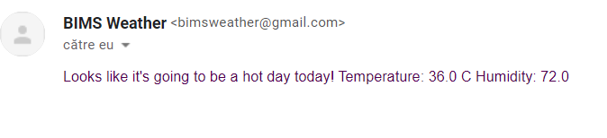
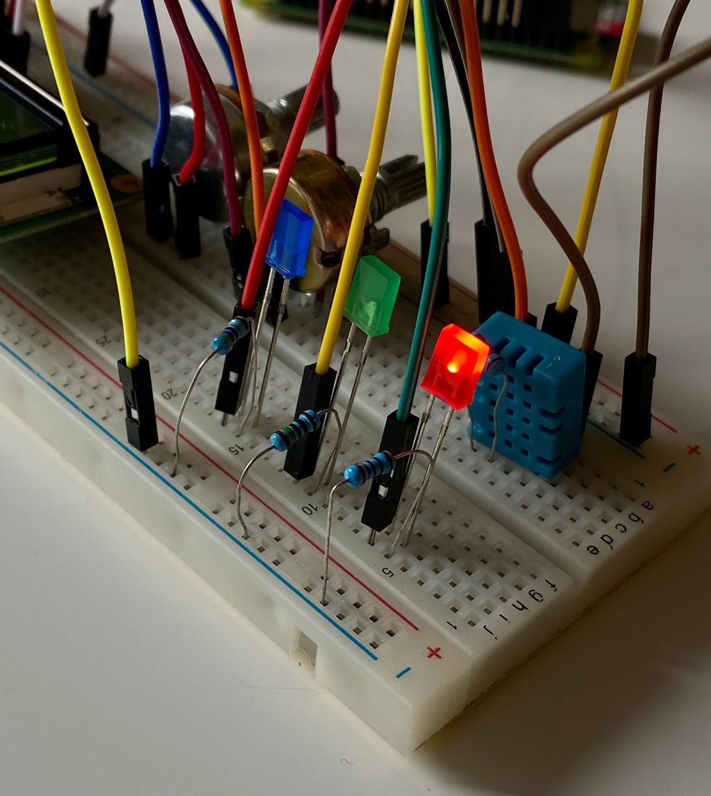
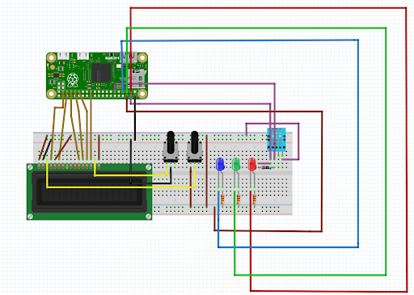
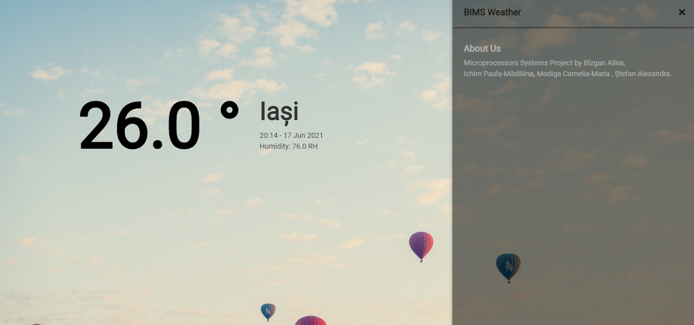

# BIMS-Weather-SM-Project
A project for Microprocessors Systems using Raspberry PI Zero W

# Students:
Bîzgan Alina-1306B    
Ichim Paula-1308A     
Modiga Camelia-1306B   
Ștefan Alexandra-1306B

# Links:
Hackster.io: https://www.hackster.io/camelia-modiga/temperature-and-humidity-system-monitoring-using-raspberrypi-1e52b3 

Demo: https://www.youtube.com/watch?v=kz0cqbYBGAE&ab_channel=AlinaB%C3%AEzgan 

Github: https://github.com/ichimpaulamadalinamalina/BIMS-Weather-SM-Project

# Elevator Pitch

Simple project that uses a Raspberry Pi Zero W in order to read data from a temperature and humidity sensor and display it on a flask website and a LCD Display.

Depending on the read data, the user will be notified by email about the weather forecast and a LED of a specific color will turn on.

# Story

BIMS Weather enables users to get instant alerts regarding weather conditions. Weather applications are the simplest method to know about the updates of the upcoming weather.
We use the DHT11 temperature and humidity sensor because it is a nice little sensor that provides digital temperature and humidity readings. 
The DHT11 has a surface mounted NTC thermistor and a resistive humidity sensor.

An IC on the back of the module converts the resistance measurements from the thermistor and humidity sensor into digital temperature (in °C) and relative humidity measurements.
In this project the temperature and humidity are displayed on a LCD Display and on a website. Therefore if you refresh the page the information will also be updated in real time.

If the temperature is lower than 20 degrees Celsius, the blue LED will turn on and a warning email will be sent about the cold weather. The second case includes temperatures between 20 and 32 degrees Celsius that indicate a good weather, the green LED will turn on and the email will notify the user about the good weather conditions. If the temperature is higher than 32 degrees, the red LED will turn on and a warning email about the hot weather will be sent.

# Cover

# Hardware Components
 + **1 x Raspberry Pi Zero W**

 + **1 x Red LED**

 + **1 x Blue LED**

 + **1 x Green LED**

 + **1 x BreadBoard**

 + **1 x DHT11 -Temperature and Humidity Sensor**

 + **1 x Resistor 10k Ohm (for sensor)**

 + **1 x Resistor 180 Ohm( for red LED)**

 + **1 x Resistor 150 Ohm(for green LED)**

 + **1 x Resistor 68 Ohm (for blue LED)**

 + **1x LCD Display H1602F**  

 + **40 Pin 2mm Pitch Double Row Straight Header Connector Strip Bar**

 + **2 x Wh148 potentiometer 10k Ohm**

 + **13 x Male to Female Jumper Wires**

 + **10 x Male to Male Jumper Wires**

# Software apps and online services
 + **Raspberry Pi Raspbian**
 
 + **Putty**
 
 + **Python 3.8**
 
 + **Python module: flask, Adafruit_DHT, email.mime.text**
 
 + **HTML, CSS and JavaScript on the client-side**

# Pictures

# An example when the email is sent and the warning LED turns on if the temperature is greater than 32 degrees Celsius.

# Schematics

# The Raspberry pins used in this project:

1. For LEDS:

+ **Pin 3(GPIO2): connected with the anode of the green LED**

+ **Pin 5(GPIO3): connected with the anode  of the red LED**

+ **Pin 7(GPIO4): connected with the anode  of the blue LED**

+ **Pin 6(GROUND): connected with the cathode of the LEDS**

      Note: Each LED has a resistor.

2. For DHT11 sensor:
 
+ **Pin 4(5 V): connected with the VCC pin of the sensor**

+ **Pin 6(GROUND): connected with the GROUND pin of the sensor**

+ **Pin 11(GPIO17): connected with the DATA/SIGNAL pin of the sensor**

       Note: The sensor has a resistor.

3. For LCD Display

+ **Pin 2(5 V): connected with the pin 2 of LCD Display and pin 2 of first potentiometer**

+ **Pin 6(GROUND): connected with pin 1,5,16 of LCD Display and pin of the second potentiometer**

+ **Pin 23(GPIO11): connected with the pin 14 of LCD Display**

+ **Pin 29(GPIO 5): connected with the pin 13 of LCD Display**

+ **Pin 31(GPIO6): connected with the pin 12 of LCD Display**

+ **Pin 33(GPIO13): connected with the pin 11 of LCD Display**

+ **Pin 35(GPIO19): connected with the pin 6 of LCD Display**

+ **Pin 37(GPIO26 ): connected with the pin 4 of LCD Display** 

      Note: The display is connected with pin 3 and 15 at the two potentiometers.

# Installation required and steps to reproduce this project on your system:

+ **Set up your RaspberryPi platform**

+ **Go to the GitHub repository** 

      https://github.com/ichimpaulamadalinamalina/BIMS-Weather-SM-Project

+ **Download the repository by clicking the "Download ZIP" button or just clone the repository if you have Git** 

+ **$ cd server to move into the source directory**

+ **$ python3 -m venv env to create a virtual environment**

+ **$ source env/bin/activate to activate the virtual environment**

+ **$ pip3 install -r requirements.txt to install all necessary dependencies.**

+ **This will install:**

     Adafruit-DHT==1.4.0

     Flask==1.0.2

     RPi.GPIO==0.7.0

     RPLCD==1.3.0

+ **$ python3 temp.py to launch the server** 
+ **Open your browser and go to ip_raspberry:5000/index  (ex:192.168.244.37:5000/index)**

# Web page

